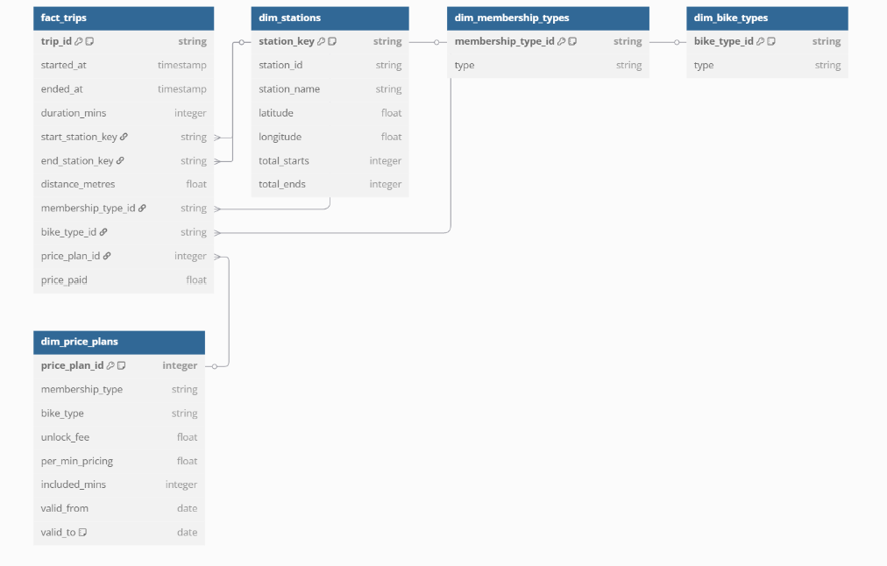

```
Table fact_trips {
  trip_id string [pk, note: 'Unique trip ID from source dataset']
  started_at timestamp
  ended_at timestamp
  duration_mins integer
  start_station_key string
  end_station_key string
  distance_metres float
  membership_type_id string
  bike_type_id string
  price_plan_id integer
  price_paid float
}

Table dim_stations {
  station_key string [pk, note: 'Generated using dbt_utils.generate_surrogate_key']
  station_id string
  station_name string
  latitude float
  longitude float
  total_starts integer
  total_ends integer
}

Table dim_membership_types {
  membership_type_id string [pk, note: 'Generated using dbt_utils.generate_surrogate_key']
  type string
}

Table dim_bike_types {
  bike_type_id string [pk, note: 'Generated using dbt_utils.generate_surrogate_key']
  type string
}

Table dim_price_plans {
  price_plan_id integer [pk, note: 'From seed CSV']
  membership_type string
  bike_type string
  unlock_fee float
  per_min_pricing float
  included_mins integer
  valid_from date
  valid_to date [note: 'Defaults to 9999-12-31 if still valid']
}

Ref: fact_trips.bike_type_id > dim_bike_types.bike_type_id
Ref: fact_trips.start_station_key > dim_stations.station_key
Ref: fact_trips.end_station_key > dim_stations.station_key
Ref: fact_trips.membership_type_id > dim_membership_types.membership_type_id
Ref: fact_trips.price_plan_id > dim_price_plans.price_plan_id

````