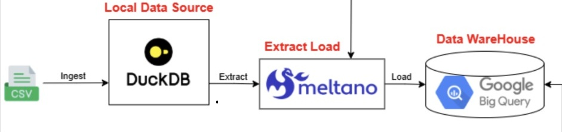

# Citibike Trip Data Extraction and Loading

Data is downloaded as csv file from Kaggle and load into DuckDB (local data source)

We use Meltano to orchestrate an EL pipeline

Extractor ( tap-duckdb ): to stream the raw data out of DuckDB

Loader ( target-bigquery ): will receive that stream and load it into BigQuery inside Google Cloud Project

Once the raw data is available in BigQuery, we can use dbt to clean, test and model the newly-ingested data.
