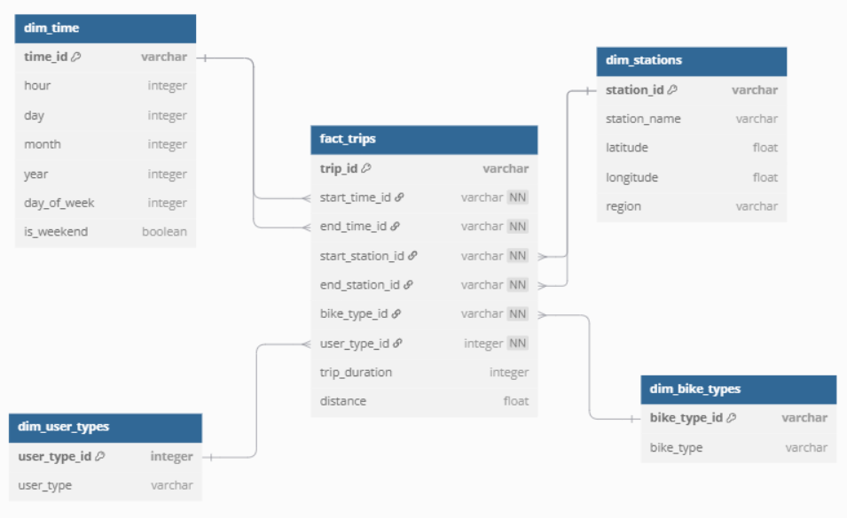

``` DBML
// Fact Table: Bike Trips
Table fact_trips {
  trip_id varchar [pk]
  start_time_id varchar [not null]
  end_time_id varchar [not null]
  start_station_id varchar [not null]
  end_station_id varchar [not null]
  bike_type_id varchar [not null]
  user_type_id integer [not null]
  trip_duration integer
  distance float [null]
}

// Dimension Table: Time
Table dim_time {
  time_id varchar [pk] // Format: YYYYMMDDHHMMSS
  hour integer
  day integer
  month integer
  year integer
  day_of_week integer
  is_weekend boolean
}

// Dimension Table: Stations
Table dim_stations {
  station_id varchar [pk] // e.g., "JC013", "NY345"
  station_name varchar
  latitude float
  longitude float
  region varchar // "NYC" or "JC"
}

// Dimension Table: Bikes
Table dim_bike_types {
  bike_type_id varchar [pk]
  bike_type varchar // "Classic", "Electric"
}

// Dimension Table: User Types
Table dim_user_types {
  user_type_id integer [pk]
  user_type varchar // "Subscriber", "Customer"
}

// Relationships
Ref: fact_trips.start_time_id > dim_time.time_id
Ref: fact_trips.end_time_id > dim_time.time_id
Ref: fact_trips.start_station_id > dim_stations.station_id
Ref: fact_trips.end_station_id > dim_stations.station_id
Ref: fact_trips.bike_type_id > dim_bike_types.bike_type_id
Ref: fact_trips.user_type_id > dim_user_types.user_type_id
```