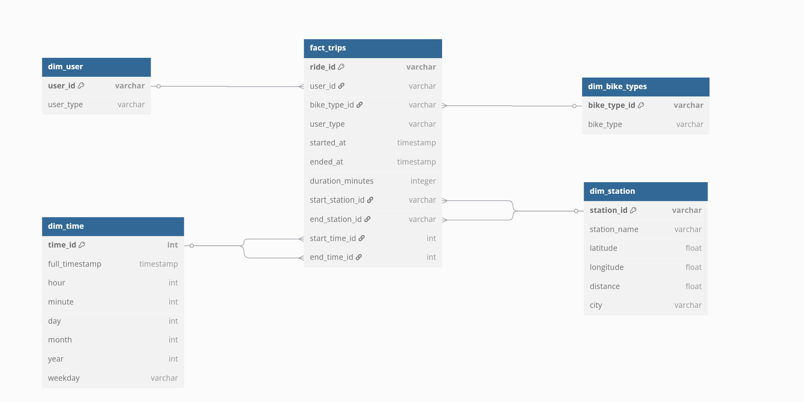

```
Table dim_user {
  user_id            varchar [primary key]
  user_type          varchar             // "casual" or "member"
 }


// rideable_types changed to bike_types
Table dim_bike_types {  
  bike_type_id varchar [primary key]
  bike_type    varchar
}

Table dim_time {
  time_id        int    [primary key]
  full_timestamp timestamp //Time indicated in the UTC / 24 hrs
  hour           int
  minute         int
  day            int
  month          int
  year           int
  weekday        varchar
}

Table dim_station {
  station_id   varchar [primary key]
  station_name varchar
  latitude     float
  longitude    float
  distance     float // Haversine formula to calculate the distance
  city         varchar
}

Table fact_trips {
  ride_id          varchar [primary key]
  user_id          varchar               // → dim_user.user_id
  bike_type_id     varchar               // → dim_bike_types.bike_type_id
  user_type        varchar
  started_at       timestamp
  ended_at         timestamp
  duration_minutes integer
  start_station_id varchar               // → dim_station.station_id
  end_station_id   varchar               // → dim_station.station_id
  start_time_id    int                   // → dim_time.time_id
  end_time_id      int                   // → dim_time.time_id
}


Ref: fact_trips.user_id         > dim_user.user_id
Ref: fact_trips.bike_type_id    > dim_bike_types.bike_type_id
Ref: fact_trips.start_station_id> dim_station.station_id
Ref: fact_trips.end_station_id  > dim_station.station_id
Ref: fact_trips.start_time_id   > dim_time.time_id
Ref: fact_trips.end_time_id     > dim_time.time_id

```